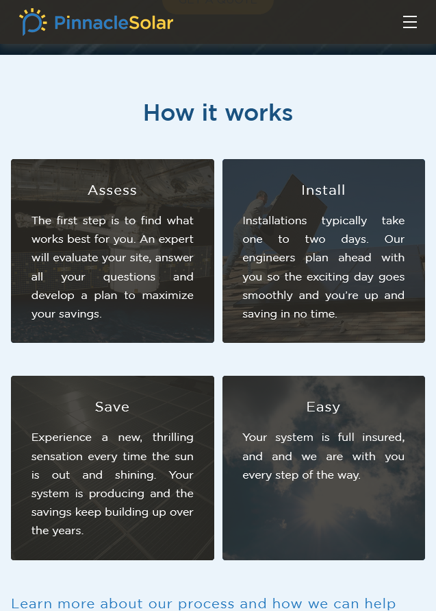

# Pinnacle Solar Website Theme

## Description

A website theme for eventual deployment on Wordpress. Class naming follows the BEM convention and the folder structure is based on the 7-1 convention. The layout uses CSS grid. CSS styling is written in SCSS (Sass) and is compiled with NPM autoprefixer, concat, npm-run-all, postcss-cli and sass.

## Tech Stack

- PHP
- Javascript
- Sass
- wordpress/scripts

## Screenshots

## Deployment

[Github Pages](https://agdesignz.github.io/pinnacle-solar/)

[Wordpress PHP Version](https://github.com/agDesignz/pinnacle-solar_wp)

## Usage

From the root directory, open the command line and run `npm run start`. The site should open in the browser automatically. To compile the code for a build, run `npm run build:css`.

## Contact Me:

email: [alexgeorgegeer@gmail.com](alexgeorgegeer@gmail.com)
Github: [agDesignz](https://github.com/agDesignz)

## License

Licensed under the [MIT](https://opensource.org/license/mit/) license.
